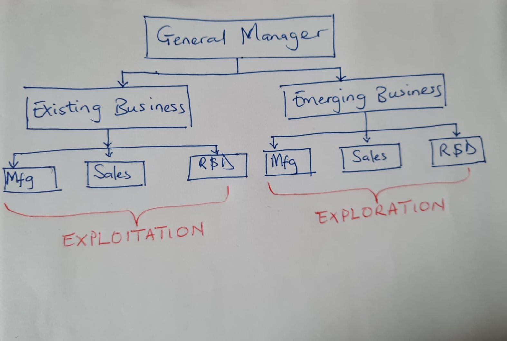

# 2021-WS: Digital Organization

# Ambidextrous Organization
Presented by  Addah Opondo & Brinsley Ngasi

---

## Table of content
1. Introduction
1. Definition
1. Eploitation vs Exploration
1. Types of Organizational Ambidexterity
1. Challenges of Building an Ambidextrous Organization
1. Attributes of an Ambidextrous Individual
1. case study: Renault 
1. conclusion
1. References

---

## Quote

It is not the strongest of the species that survive, nor the most intelligent, but the one most responsive to change.
		“Charles Darwin (1809–1882), English naturalist”

---

## Introduction

-  Innovation and change = Challenges

    why is this problem persistent?

     Why is it difficult for organizations to overcome these problems?

     Why are the patterns of success - and failures so prevalent across industries?

- Longterm success = Ambideterity

---

## What is an Ambidextrous Organization ?

---Diagram i drew with hand ---

Establishment of project teams that are structurally independent units, each having its own processes, structures and cultures that are intergrated into the existing management hierachy. 

---

## Exploitation vs Exploration

--- preferably on a table  Eploration vs Eploitation

### Exploitation

-  Improving products and  services  
- Contineous request for raising quality 
- renewal based on ideas from within and outside the firm.
-  Improvement of the current business model
- Cost, profit
- Authoritative, Topdown
- Low Risk
---

### Exploration

- New technologies and business models.
- No disruptive innovations rather imaginative ideas
- Creative thinking is necessary and
dominant logic is challenged.
-  Create new business models
- Innovation, growth 
- Visionary, Involved
- High Risk
---

## Types of  Organizational ambidexterity
- Structural anbidexterity 
- Contextual ambidexterity 
- Sequential ambidexterity
- Intellectual ambidexterity

## Challenges of Building an Ambidextrous Organization

- Eploitation is addictive
- Exploration is uncertain
- Breakthrough Innovation in an extablished company is difficult.
- multiple cultures within thesame organization
- Managerial difficultiies- different cultures an stratergies.

---

## Success stories ( case study)

> #### IBM Life Sciences 

--- can you please sumarize the case study in fewe words how you would like to present it ---

- In 2000, IBM began a programmatic effort to identify and develop cross-IBM business that could provide $1B in revenue within a 5-year time frame.
- The then IBM R&D manager, Carol Kovac, was asked to establish a new Life Science business that would capitalize on the increased demand for computing being generated by the genomic revolution.
- Between its founding and 2006, Carol grew the business to $5B in revenue.

---

> #### Cisco TelePresence 

- Sells plumbing for the internet with a net worth of $22B.
- It has experienced an annual steady growth rate of 12-17% and currently has a dominant market share in its main businesses.
- John Chambers, the CEO, launched an ambitious initiative to identify 30 new potential $1B businesses. This was part of his effort to continue Cisco Systems growth
- The aim was to generate 25% of the firm’s revenues from these new ventures within 5-10 years which was succssesfully implemented with a lucrative growth of $200M in revenue.

## Failure stories

> #### Software company

- Under pressure from corporate executives, the general manager of Software Company articulated a strategic intent to both build on its struggling product line and initiate a remarkable set of new software solutions.
- He built a separate unit, reporting directly to him, to focus on innovation. 
- Over a three-year period, he did not, however, staff or fund this innovative unit.
- The unit underperformed in its existing as well as its innovative product line.. 

> ### Success and failure stories analyzed

|                    | 1          | 2     | 3     | 4     | 5    | Overall performance       | 
| -------------      |:----------:| -----:| ------| ------|------|---------------------------|
| IBM Life Sciences  | Yes        | Yes   | Yes   | Yes   |Yes   |Success                    |
| Cisco TelePresence | Yes        | Yes   | Yes   | Yes   |Yes   |Success                    |
| Software company   | Yes        | No    | No    | Yes   |No    |Poor Innovation Performance|

---
Conclusion

Established companies in Mature business can revitalise themselves through thier ability to build new businessen without destroying thier traditional business which is the hallmark of an ambidextroux company. Thus, top manager in ambidestrous organisations should adept at structuring the organization to combine organizational seperation at business level at thesame time intergrated at business Level.

---

## Attributes of an ambidextrous Individual

1. They take the initiative.
1. They are cooperative.
1. They are brokers.
1. They are multitaskers.

## Case Study: Renault
- Is a French Automobile manufacturer established in 1899.
- It went through a radical transformation during the 1990s. 
- Louis Schweitzer acted as the CEO in 1992, a time when the company was languishing. 
- Cut costs through a number of well publicized plant closures.
- Invested in new product development.
- Searched for a strategic partner.
- It gained control of Nissan in 1998.
- By 2001, most profitable Auto companies in the world.

---
## Renault: How did the transformation take place?

- Schweitzer developed a simple and consistent strategy.
- The strategic planning, budgeting processes, bonuses and the stock option plans were all aligned with these goals.
- The communication of the message was in the word of one executive.
- The company developed  ‘’ A deep desire to adapt.’’ attitude.
- The management style was informal and expressing views was encouraged.
- Result? An organization that became proficient at continually making small adaptations to its strategy without losing alignment.

---

Thank You.

QUESTIONS ?

---