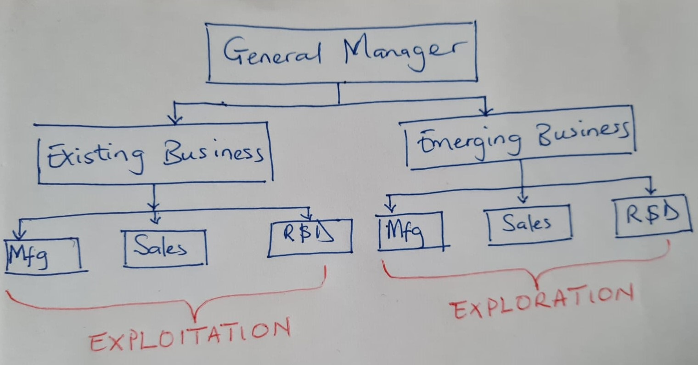

# 2021-WS: Digital Organization

# Ambidextrous Organization
Presented by  Addah Opundo & Brinsley Ngasi

---

## Table of content
1. Introduction/Definition
1. Eploitation vs Exploration
1. Types of Organizational Ambidexterity
1. Challenges of Building an Ambidextrous Organization
1. Attributes of an Ambidextrous Individual
1. case study: Renault 
1. conclusion/References

---

## Quote

It is not the strongest of the species that survive, nor the most intelligent, but the one most responsive to change.
		“Charles Darwin (1809–1882), English naturalist”

---

## Introduction

-  Innovation and change = Challenges

    why is this problem persistent?

     Why is it difficult for organizations to overcome these problems?

     Why are the patterns of success - and failures so prevalent across industries?

- Longterm success = Ambideterity

---

## What is an Ambidextrous Organization ?

- Establishment of project teams that are structurally independent units, each having its own processes, structures and cultures that are intergrated into the existing management hierachy.
- Ambidexterity is an organization’s capability to simultaneously pursue and balance exploration and exploitation.

---

### Ambidextrous Organization Diagram Representation

---

## Exploitation/Exploration Defined

- Exploration refers to the discovery of new products, resources, knowledge and opportunities, and it is associated with radical changes and learning through experimentation.
- Exploitation refers to the refinement of existing products, resources, knowledge and competencies, and is associated with incremental changes and learning through local search.

---
## Exploitation vs Exploration

Exploration                                            | Exploitation                         |
| -------------                                         |:------------------------------------:|
| Unknown needs to be discovered or explored           | Known needs to be exploited                  |
| Risk taking, experimentation, discovery & innovation | refinement, efficiency, selection, implementation & execution |
| learning process involves following a new trajectory | learning process follows an existing trajectory             |
| Returns are less certain and more distant in time    | Returns are more certain and achievable in a shorter time frame       |

---

## Types of  Organizational ambidexterity
- Structural anbidexterity 
- Contextual ambidexterity 
- Sequential ambidexterity
- Intellectual ambidexterity

---

## Challenges of Building an Ambidextrous Organization

- Eploitation is addictive
- Exploration is uncertain
- Breakthrough Innovation in an extablished company is difficult
- Multiple cultures within thesame organization
- Managerial difficultiies- different cultures an stratergies

---

## Attributes of an ambidextrous Individual

1. They take the initiative.
1. They are cooperative.
1. They are brokers.
1. They are multitaskers.

---

## Case Study: Renault

- Is a French Automobile manufacturer established in 1899.
- It went through a radical transformation during the 1990s. 
- Louis Schweitzer acted as the CEO in 1992, a time when the company was languishing. 
- Cut costs through a number of well publicized plant closures.
- Invested in new product development.
- Searched for a strategic partner.
- It gained control of Nissan in 1998.
- By 2001, most profitable Auto companies in the world.

---

## Renault: How did the transformation take place?

---

## Conclusion

Established companies in Mature business can revitalise themselves through thier ability to build new businessen without destroying thier traditional business which is the hallmark of an ambidextroux company. Thus, top manager in ambidestrous organisations should adept at structuring the organization to combine organizational seperation at business level at thesame time intergrated at business Level.

---
Thank You.

QUESTIONS?

---
