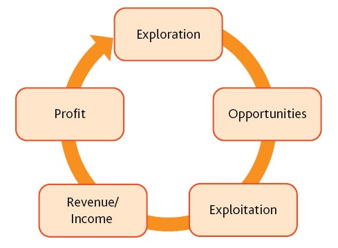

# 2021-SS: Digital Organization

## Ambidextrous Organization

Presented by  Addah Opundo & Brinsley Ngasi

---

## Table of content

1. Introduction/Definition
1. Exploitation/Exploration
1. Types of Organizational Ambidexterity
1. Challenges of Building an Ambidextrous Organization
1. Conditions for Ambidexterity
1. Attributes of an Ambidextrous Individual
1. case study: Renault
1. conclusion/References

---

## Quote

It is not the strongest of the species that survive, nor the most intelligent, but the one most responsive to change.
		“Charles Darwin (1809–1882), English naturalist”

---

## Introduction

- Innovation and change = Challenges

    why is this problem persistent?

     Why is it difficult for organizations to overcome these problems?

     Why are the patterns of success - and failures so prevalent across industries?

- Long term success = Ambidexterity

---

## What is an Ambidextrous Organization ?

- Establishment of project teams that are structurally independent units, each having its own processes, structures and cultures that are integrated into the existing management hierarchy.
- Ambidexterity is an organization’s capability to simultaneously pursue and balance exploration and exploitation.

---

### Ambidextrous Organization: Diagram

---

## Exploitation/Exploration Defined

- Exploration is the discovery of new products and opportunities.
- Exploitation is the refinement of existing products and competencies.

---

## Exploration versus Exploitation

|Exploration         | Exploitation     |
|:------------------:|:----------------:|
| Radical changes   | Incremental changes   |
| Unknown needs     | Known needs         |
| Experimentation & innovation | refinement & efficiency |
| New trajectory | Existing trajectory     |
| Less certain and distant | Certain & shorter time frame|

---

## Association between exploration and exploitation

---

## Types of Organizational ambidexterity

- Structural ambidexterity.
- Contextual ambidexterity.
- Sequential ambidexterity.
- Intellectual ambidexterity.

---

## Challenges of Building an Ambidextrous Organization

- Exploitation is addictive.
- Exploration is uncertain.
- Breakthrough Innovation in an established company is difficult.
- Multiple cultures within the same organization.
- Managerial difficulties- different cultures an strategies.

---

## Conditions for Ambidexterity

1. Strategic intent.
1. Vision and values.
1. Explicit Senior team.
1. Separate units.
1. Ambidextrous Leadership.

---

